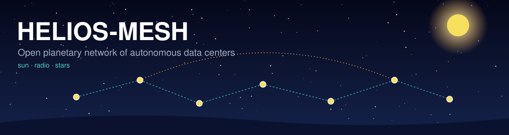
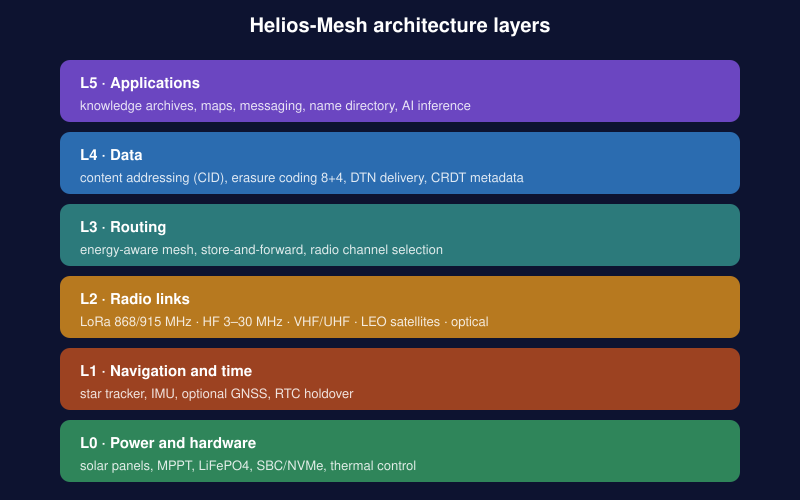
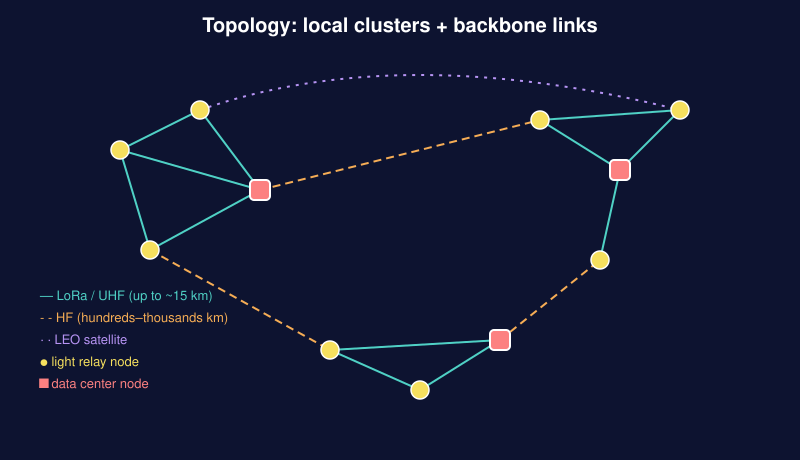

<p align="center"></p>

# Helios-Mesh

**An open planetary network of autonomous data centers and mesh routing, powered by solar energy, radio links and star navigation.**

> Status: concept + reference implementation (v0.2). Radio and time are simulated. This is not a production-ready system.

## Idea
- Every node generates its own power (solar) and runs on a battery.
- Links are radio: LoRa, VHF/UHF, HF and LEO satellites. Ground infrastructure is not required.
- A node can verify its position and time using the stars when GNSS is unavailable or spoofed.
- Data is stored in a distributed way and delivered store-and-forward, even across link outages.

## Principles
| Principle | In practice |
|---|---|
| Autonomy | solar + LiFePO4, power-saving mode at night |
| Resilience | no single point of failure, self-healing |
| Delay tolerance | DTN: an end-to-end path need not exist at all times |
| Energy awareness | routes and tasks depend on battery charge |
| GNSS independence | stars and RTC as a fallback and a cross-check |

## Architecture


| Layer | Purpose | Code (`helios.py`) |
|---|---|---|
| L0 | Power and hardware | `EnergyScheduler`, `daily_harvest_wh`, `autonomy_days` |
| L1 | Navigation and time | `latitude_from_polaris`, `gmst_deg`, `longitude_from_transit`, `gnss_spoof_suspect` |
| L2 | Radio links | `CHANNELS`, `choose_channel`, `pack` / `unpack` / `forward` |
| L3 | Routing | `Router`, `DTNQueue` |
| L4 | Data | `cid`, `encode` / `decode` (Reed-Solomon 8+4) |
| L5 | Applications | `Node`, `publish`, `fetch` |

## Topology


Local clusters on LoRa/UHF are joined by HF and satellite backbone links. Data center nodes (storage, compute) act as gateways between clusters.

## Node classes
| Class | Role | Hardware estimate |
|---|---|---|
| Light relay | forwarding, cache | MCU/SBC, LoRa, 20–100 W panel, 0.2–1 kWh battery |
| Data center | storage, compute, HF/satellite gateway | SBC/mini-PC, 4–32 TB NVMe, 200–1000 W panels, 2–10 kWh battery |

Example energy budget of a data center node: about 540 Wh/day (SBC + NVMe 360, LoRa/UHF 72, HF at 10% transmit 96, star tracker 10). With 4 peak sun hours and 25% losses you need at least about 180 W of panels; in practice 300–500 W. A 2 kWh battery gives roughly 2 days of autonomy.

## Power modes
| Mode | State of charge | Behavior |
|---|---|---|
| full | above 65% | all radios, replication, compute |
| eco | 35–65% | LoRa/UHF, forwarding only |
| survival | 20–35% | LoRa only, emergency messages |
| sleep | below 15–20% | deep sleep on a schedule |

Transitions use a 5% hysteresis so the mode does not flap.

## Radio links
| Link | Band | Range | Rate | Role |
|---|---|---|---|---|
| LoRa | 433/868/915 MHz | 2–15 km | 0.3–50 kbit/s | local mesh, telemetry |
| VHF/UHF | 144/433 MHz | 20–100 km | 1.2–100 kbit/s | regional links |
| HF | 3–30 MHz | 500–10,000 km | 0.1–10 kbit/s | backbone via the ionosphere |
| LEO satellite | UHF/VHF/S | global, in passes | 1.2–9.6 kbit/s | inter-regional delivery |

`choose_channel(size, distance_km, allowed, sat_window, urgent)` picks the channel with the shortest transmit time among those that reach the target.

## Routing
Edge cost: `cost = ETX × (1 + K × (1 − SoC_receiver))`, with K = 4. Nodes below 15% charge do not carry transit traffic. If no path exists, a bundle waits in `DTNQueue` (priorities and expiry time).

## Star navigation
1. **Latitude** from the altitude of Polaris: `phi ≈ h − p·cos(LHA)`, `p ≈ 0.7°`.
2. **Longitude** from the moment a star crosses the meridian plus accurate time: 1 s of clock error ≈ 460 m at the equator.
3. **Orientation** for pointing directional HF/optical antennas.
4. **GNSS check:** a latitude mismatch above 30 km is flagged as possible spoofing.

The formulas are simplified. Real accuracy needs refraction, precession, nutation and a star catalog. Clouds and daylight make this a fallback, not the primary source.

## Data
- **CID:** `h1-` + SHA-256 of the content; integrity can be checked on any node.
- **Reed-Solomon 8+4 over GF(256):** an object is split into 12 shards and can be rebuilt from any 8.
- **LoRa frame:** 12-byte header, up to 200 bytes of payload, truncated HMAC-SHA256 tag (8 bytes), TTL.

## Security
The reference uses HMAC in place of signatures. A production version should use Ed25519 for identity, X25519 + ChaCha20-Poly1305 for encryption, node reputation based on contribution (capacity, uptime) against Sybil attacks, disk encryption and tamper detection. Amateur radio bands often forbid encryption; in that case use authentication only.

## Quick start
Requires Python 3.10+. No dependencies.

```bash
python3 -m unittest -v test_helios   # 8 tests
python3 demo.py                      # publish, lose nodes, recover, route
```

Example:

```python
from helios import Node, publish, fetch

nodes = [Node(f"DC{i}") for i in range(6)]
cid, n = publish(b"hello", nodes)
nodes[0].shards.clear(); nodes[1].shards.clear()   # 4 of 12 shards lost
assert fetch(cid, n, nodes) == b"hello"
```

## Files
| File | Contents |
|---|---|
| `README.md` | this document |
| `helios.py` | all code, L0–L5 |
| `test_helios.py` | 8 tests |
| `demo.py` | demonstration |
| `banner.svg`, `architecture.svg`, `mesh-topology.svg` | illustrations |

## Roadmap
- v0.2: reference implementation and tests (current).
- v0.3: daemon on real LoRa hardware, test network of 10–20 nodes.
- v0.4: HF gateways and satellites (SatNOGS-compatible stations).
- v0.5: star tracker and GNSS cross-check.
- v1.0: open protocol specification and reference hardware.

## Legal notes
Radio spectrum is regulated. LoRa/ISM has power and duty-cycle limits; HF and VHF/UHF usually require an amateur radio license. Check local rules before deploying.

## License
MIT.
